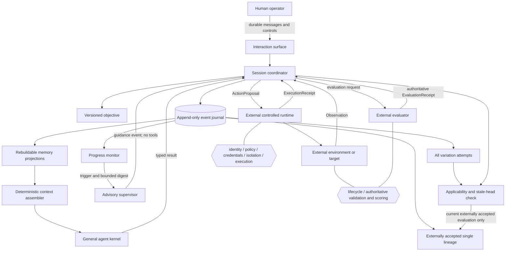
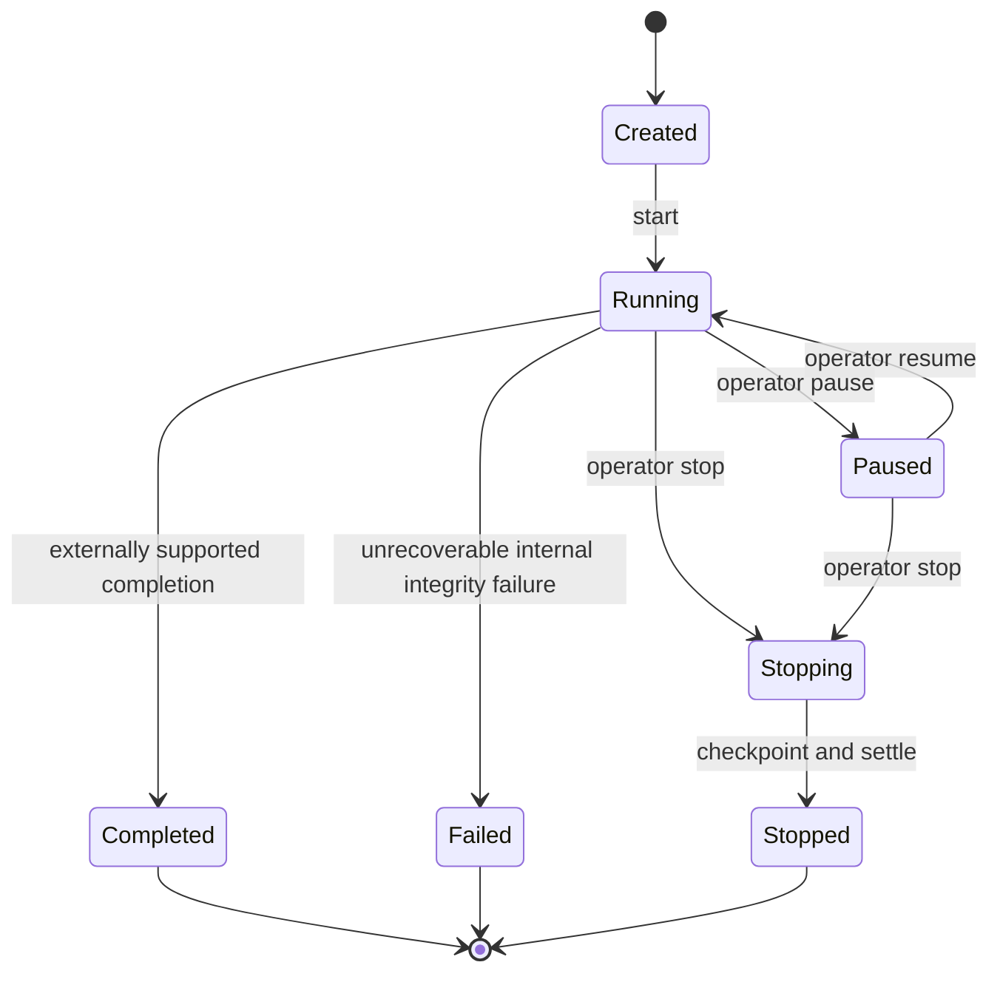

# Vharness Next system and control flow

This cross-document view represents ARCH-0001 and ADR-0001 through ADR-0005.
Arrows crossing the runtime boundary are proposals and receipts, never direct
Vharness execution authority.

## Notes and unresolved branches

The initial coordinator has one event writer, at most one unresolved
state-changing proposal per session, and one committed lineage. An attempt may
span many actions; only external acceptance advances lineage. Population/archive
branching is deferred. No unresolved branch blocks PHASE-0001.
