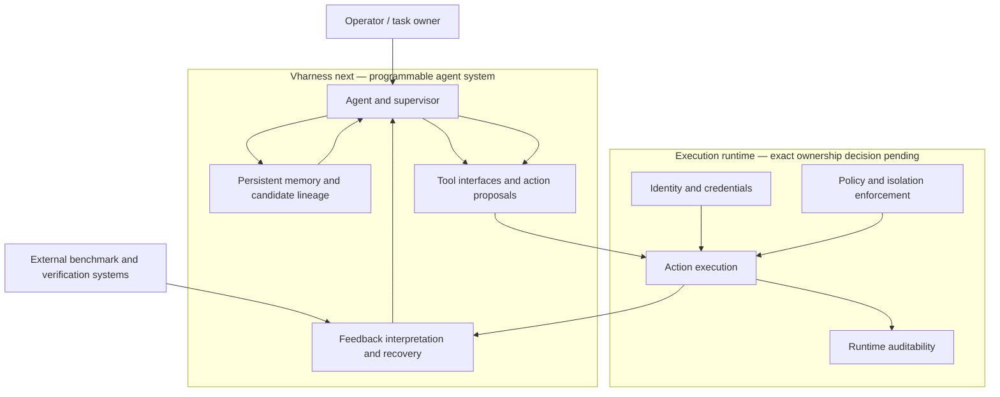

# System context

Status: initial schematic; enforcement boundary decision pending.

## Current agreement

- AVO concerns sustained capability: memory, execution feedback, recovery,
  supervision, and long-running progress.
- The agent and harness may propose actions.
- Existing external systems continue to own authorization, target lifecycle,
  benchmark verification, and other responsibilities assigned to them by the
  repository operating boundary.

## Decision pending

`plans/agentstorm.md` currently assigns enforcement responsibilities to
Vharness core, while the NVIDIA-informed model places authoritative identity,
policy, credentials, isolation, and auditability below the programmable
harness. Do not implement either placement as settled until the governing
direction is chosen and recorded in `plans/decision-log.md`.

