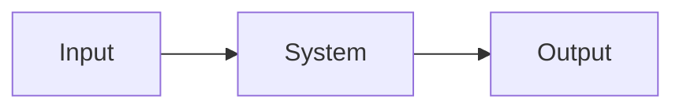

# Schematic title

Projects should use searchable Mermaid diagrams and identify the accepted
architecture or decisions represented by this view. Prefer embedding a diagram
in its governing document; use a standalone schematic only for a view spanning
multiple governing documents or requiring an independent lifecycle.

## Notes and unresolved branches
