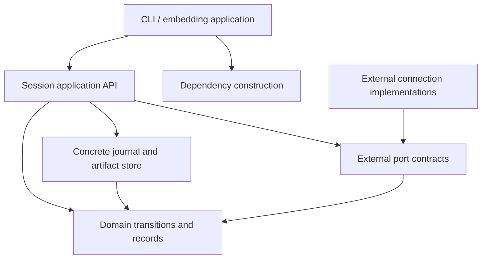

# Library structure and engineering rules

## Package and dependency direction

Place the new implementation under `src/vharness/agent/`. This namespace is
initially opt-in; existing `vharness` entry points retain their behavior.

Use composition with explicit constructor parameters. Domain modules depend on
standard-library types and local domain records. Application orchestration uses
those modules and external port contracts. Infrastructure implements I/O.
Only the composition root constructs concrete dependencies from configuration.

Keep the concrete SQLite store: an interchangeable storage framework is not
required. Protocols belong at real external boundaries, where deterministic
test implementations also exist. No dependency-injection container, plugin
discovery system, generic repository base class, or global service registry.

## Module ownership

The first-phase modules have these responsibilities. Names below are the default
implementation map; splitting further requires a distinct responsibility, not a
line-count target.

| Module | Owns | Does not own |
| --- | --- | --- |
| `__init__.py` | Explicit small public exports | Client construction, registrations, file access |
| `models.py` | Domain records, enums, value types | Parsing untrusted dictionaries or database access |
| `codec.py` | Versioned JSON decoding/encoding and boundary validation | Session policy, external scoring |
| `transitions.py` | Legal transitions, applicability checks, deterministic event reduction | Time/ID generation, SQL, I/O |
| `resources.py` | Reservation and measured-usage calculations | Provider calls, pricing guesses |
| `journal.py` | SQLite transactions, ordered reads, schema compatibility | Agent decisions, terminal formatting |
| `artifacts.py` | Content-addressed byte publication and verified reads | Interpretation of evidence |
| `ports.py` | Environment, runtime, evaluator callable contracts | Concrete transport or authorization logic |
| `session.py` | Session API, serialized coordinator, operation scheduling and recovery | SQL statements, JSON parsing, model prompts |
| `errors.py` | Small caller-relevant exception vocabulary | One exception class per function |

Place first-phase scripted agents and fake runtime/evaluators under `tests/agent/`.
A runnable example may use them only through a clearly test/demo-specific entry
point; they must never masquerade as production integrations.

Add `context.py`, `memory.py`, `kernel.py`, `supervision.py`, and concrete model
connections when their phases require them. Do not create placeholders now.
Keep transport-specific code under `agent/adapters/` when a real connection is
implemented. These adapters translate existing external contracts only.

## Public API and lifecycle

Expose `Session`, `TaskSpec`, the operator-command types, immutable session views,
and caller-relevant errors from `vharness.agent`. Expose other types from their
owning modules; do not re-export every internal record.

The application API must support creation, reopening, command submission,
bounded advancement, observation, and checkpointing without importing the CLI.
Neither creation nor reopening should silently launch an infinite execution loop.

`Session` owns coordination state, not the lifetime of dependencies supplied by
the caller. The composition root owns and closes the journal and transport
clients, using context managers where applicable. Closing local resources is not
an instruction to stop or undo external work. Return immutable views rather than
exposing mutable internal dictionaries or a live SQLite cursor.

Use classes for resource or lifecycle ownership (`Session`, `SqliteJournal`,
`ArtifactStore`). Use functions for validation, reduction, selection, and budget
arithmetic. Prefer small named methods over a giant dispatch function with nested
closures. Explicit dispatch over a finite union is appropriate; a dynamic handler
framework is not required.

## Concurrency and responsiveness

One coordinator owns state changes and the database connection. Other threads or
I/O completions enqueue typed input; they never mutate projections or write SQL.
The inbound queue is bounded and must apply backpressure rather than drop input.
It is delivery machinery, not the durable source of truth.

Keep the application API synchronously drivable through bounded steps. Slow
external calls run outside the writer path using a small owned I/O worker when
needed; their results return through the inbox. Do not run a database transaction
across a network call. Do not require an asyncio rewrite of the existing package.
Only one unresolved state-changing proposal may exist per session initially.

Operator submission returns an admission token; acknowledgement of application
requires a durable command event and an applied/rejected result. These are
different observations. Apply pending pause/stop/steering before dispatching more
work, including after a slow call returns. Commands cannot cancel an effect that
was already dispatched by merely changing local state.

## Existing-code reuse assessment

| Existing area | Treatment |
| --- | --- |
| `core.Generation` and generator request path | Potential model I/O reuse in PHASE-0002 after usage, retry, and typed-result compatibility checks |
| `core.Attempt` | Keep separate: it represents one legacy prompt, not a multi-action session attempt |
| `runner.Runner` | Preserve for legacy behavior; do not subclass it to implement the session coordinator |
| Legacy stage registries | Leave intact; new core dependencies are explicit |
| `usage.py` | Existing reporting reference; its JSONL reader is not the new journal or resource ledger |
| Existing CLI/configuration | Reuse suitable argument/configuration conventions; keep business logic in the library |
| pytest setup | Extend with `tests/agent/`, following existing fixtures and parametrization patterns |

The existing OpenAI-compatible generator has internal retries, token-limit
expansion, and a cache. A thin wrapper must not conceal those operations from
resource accounting. Its zero-default usage fields cannot establish that unknown
usage is actually zero. Resolve these at the model boundary in PHASE-0002; do not
refactor that provider during the first-phase journal implementation.

## Code quality rules

Target Python 3.10 syntax and standard-library APIs, matching `pyproject.toml`.
Do not accidentally depend on the developer machine's Python 3.14 features.
Use `str, Enum` rather than requiring `StrEnum`; use compatible type aliases.

Public methods and important internal boundaries have complete annotations and
behavioral docstrings. Document resource ownership, blocking behavior, failure
semantics, and return meaning. Comments explain invariants and decisions rather
than narrate assignments. Avoid `Any`, mutable globals, generic `utils.py`, deep
inheritance, and functions with unrelated modes controlled by boolean flags.

Library functions neither print nor configure global logging. Use ordinary
module loggers for diagnostics, typed results for callers, and journal events for
durable state. Logging is never a substitute for persistence.
